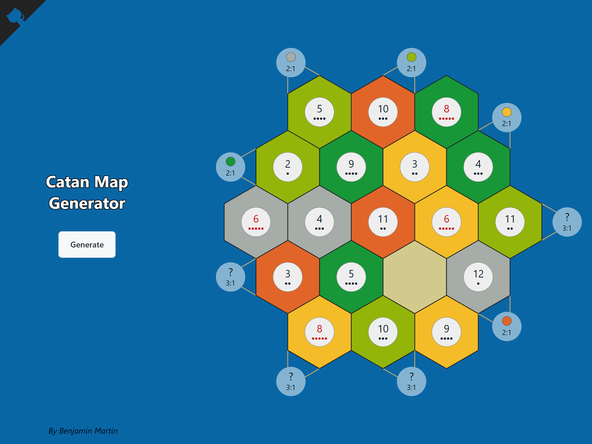

  

<!-- # Catan Map Generator -->
<h3 align="center">Catan Map Generator</h3>

A random map generator for Settlers of Catan.

&nbsp;&nbsp;&nbsp;&nbsp;&nbsp;&nbsp;&nbsp;&nbsp;&nbsp;&nbsp;&nbsp;&nbsp;&nbsp;&nbsp;&nbsp;&nbsp;&nbsp;&nbsp;&nbsp;

## [Demo](https://bm9k.github.io/catan-map-generator)
Check out the [live demo](https://bm9k.github.io/catan-map-generator)

## Features
- Works great on mobile/tablet; handy to have right on the table during setup
- Generates balanced maps according to the official rules' variable set-up 

## Contributing
Pull requests are welcome. For major changes, please open an issue first to discuss what you would like to change.

### Wanted Features
- [ ] 5-6p map
- [ ] Expansion scenarios (seafarers, cities & knights, etc.)

## License
Copyright 2021 [Benjamin Martin 🦅](https://github.com/bm9k). Released under the [MIT License](LICENSE)

## Motivation & Reflection

I wanted to explore a project with:
  - a simple application of [hexagonal grids](https://www.redblobgames.com/grids/hexagons/),
  - SVGs generated dynamically via React, and
  - a simple, responsive, full-screen layout that works across common devices

A map generator for Settlers of Catan seemed like a good choice.

The project was reasonably straight-forward, with one exception. When adding the responsive layout, I initially had a lot of trouble maximising the svg within its parent. I first tried a combination of css grid & `height: 100%` on all parents, but no matter what I tried, the SVG wouldn't expand vertically. I thought I had tried everything, so I moved on to other approaches. I tried using `100vh`, but encountered the [iOS safari 100vh "quirk"](https://stackoverflow.com/questions/37112218/css3-100vh-not-constant-in-mobile-browser), so tried to use js (React's `useLayoutEffect`) to set a css variable containing `window.innerHeight`. But this completely broke the layout when zooming.

Overall, even if it were to work, it felt quite hacky. Surely a full-screen layout with a maximised SVG should be possible with only css. So I looked for web apps that had full-screen layouts on mobile devices with the intent to reverse engineer one and discover its layout secrets.

The plan was to find a minimal working version, and attempt to replicate it one step at a time until the problem was discovered. I found a working version and used the inspector to remove all non-layout related properties. Then I replaced the react app with the basic html structure of the working layout. I added css properties to the respective elements, one by one, expecting that eventually I would find the key. But when I added the last property, my layout still wouldn't expand vertically. I disabled the property on the working version, and found that it indeed removed the vertical scaling. So why didn't it work for my version? I compared the DOM trees side-by-side, and that's when I finally found it. Initially, because I used create-react-app, I had assumed that the div returned from the top-level [`App` component](src/components/App.js) was also the direct child of `<body>`. But I had overlooked that react renders in a [root element](src/index.js). Essentially, I had missed applying `height: 100%` to one element which prevented the same from working in all of its descendants. I had wasted hours and hours running down rabbit holes when all I needed to do was add the css rule `#root {height: 100%}`🤦‍♂️ As embarassing as it is to publish, perhaps it may give encouragement to another developer. At least it was a learning experience 😅

